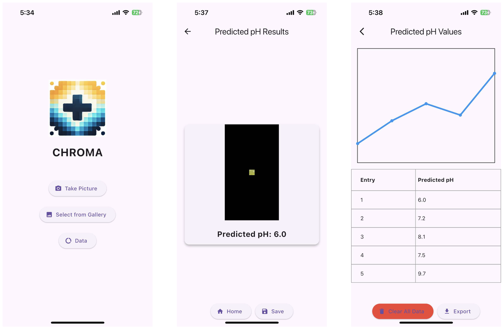
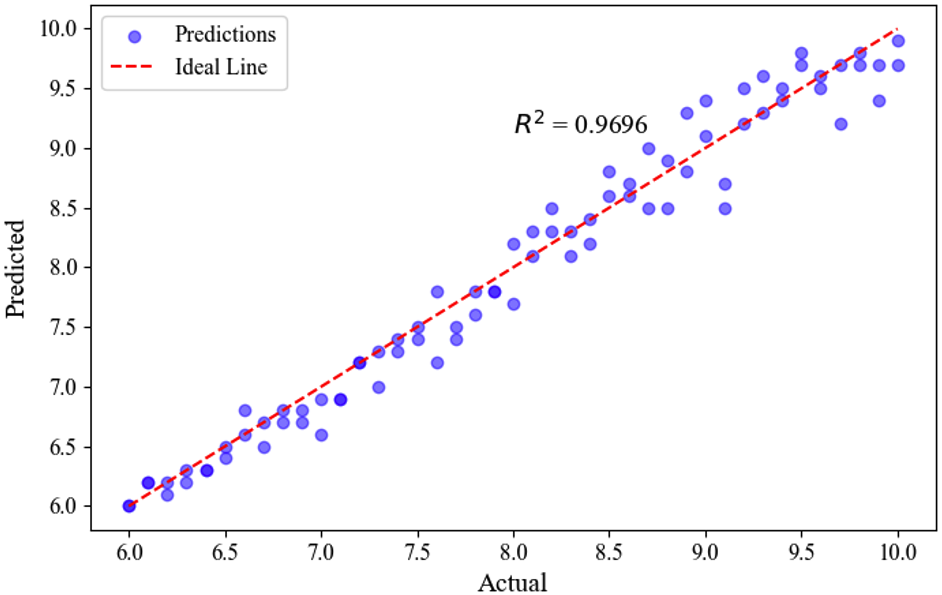

# CHROMA (Color-based Halochromic Real-time Optical Monitoring using AI)

CHROMA (Color-based Halochromic Real-time Optical Monitoring using AI) is a mobile application designed to monitor the pH levels of chronic wounds in real time. The app integrates a Multilayer Perceptron (MLP)-based computational intelligence model, successfully deployed using TensorFlow Lite for efficient on-device inference. The application was developed using the Flutter framework to ensure cross-platform compatibility and a responsive user interface.

Main functions include:
- Image acquisition with segmentation mask
- Image processing
- AI-based pH prediction
- Data visualization
- Local data storage (SQLite)
- Data export (into an Excel file)

The app features three main screens: (1) Home screen, (2) Prediction results screen, and (3) Data visualization

During the validation, it showed R² = 0.9696 as shown below:

Part of the thesis entitled: "Development of a Non-invasive Vision-based Halochromic Sensor System for Chronic Wound Monitoring"
Part of the government-funded project: "SMIDERM: Smart Multifunctional and Indigenous Dressings sterilized using the Electron Beam as Novel wound Repair Matrices"
Funded by: Department of Science and Technology-Philippine Council for Health Research and Development (DOST-PCHRD)
